# Marine Traffic Data Analysis: An Exploratory Study of Global Vessel Patterns

## Abstract

This study presents a comprehensive exploratory analysis of global marine traffic patterns derived from a snapshot of 10,379 vessels captured via the MarineTraffic.com public API. Through reverse-engineering of web application network requests, we successfully extracted real-time positioning data encompassing 21 features including geographic coordinates, vessel dimensions, operational parameters, and classification metadata. Our investigation reveals systematic relationships between vessel characteristics, identifies operational anomalies through feature engineering, and quantifies dimensional correlations across vessel types. While simple linear regression modeling is employed to satisfy academic requirements, this analysis establishes the foundational architecture for advanced machine learning applications in maritime surveillance, anomaly detection, and predictive analytics.

## 1. Introduction

### 1.1 Motivation

Maritime traffic represents a critical component of global commerce, with over 90% of international trade transported via ocean vessels. Understanding vessel behavior patterns, operational characteristics, and spatial distributions provides insights into shipping lane optimization, port congestion management, and maritime safety protocols. Traditional approaches to marine traffic analysis rely on proprietary Automatic Identification System (AIS) data feeds, which are often cost-prohibitive for academic research.

This study leverages publicly accessible web infrastructure to construct a representative dataset suitable for exploratory analysis and statistical modeling. The research addresses three primary questions:

1. What systematic relationships exist between vessel physical characteristics and operational parameters?
2. Can feature engineering reveal operational anomalies indicative of distress or unusual behavior?
3. To what extent can dimensional relationships be modeled using classical statistical techniques?

### 1.2 Data Acquisition Methodology

#### 1.2.1 API Reverse Engineering

The MarineTraffic.com web application employs dynamic map rendering with asynchronous data loading. By monitoring browser network activity through developer tools, we identified the backend JSON API endpoint structure:

```
https://www.marinetraffic.com/getData/get_data_json_4/z:{zoom}/X:{x_tile}/Y:{y_tile}/station:0
```

The API implements a tile-based geographic partitioning system where the `z` parameter controls zoom level (granularity), while `X` and `Y` represent spatial grid coordinates. Each request returns up to 2,500 vessel records in JSON format.

#### 1.2.2 Scraping Strategy

Initial reconnaissance revealed that at zoom level `z=0` (maximum zoom-out), the entire globe is accessible via a single tile coordinate `(X:0, Y:0)`, yielding approximately 2,500 vessels. To increase coverage, we increased granularity to `z=1`, which partitions the globe into four quadrants accessible via coordinate permutations: `(0,0)`, `(0,1)`, `(1,0)`, `(1,1)`. This yielded four JSON files containing 10,000+ unique vessels-a sufficiently large sample for exploratory statistical analysis.

The scraping process encountered rate limiting after initial testing, necessitating headless browser automation with randomized user-agent strings and request interval delays. Data extraction was performed using Python with the `requests` library, and JSON responses were parsed and consolidated into CSV format using `pandas`.

#### 1.2.3 Data Coverage

The resulting dataset captures a single temporal snapshot with global geographic coverage:

-   **Latitude range**: -67.4° to 81.2° (Antarctic waters to Arctic Ocean)
-   **Longitude range**: -179.9° to 179.9° (complete longitudinal span)
-   **Total observations**: 10,379 vessels
-   **Features captured**: 21 variables including positional, dimensional, operational, and categorical attributes

This represents a statistically significant cross-section of active maritime traffic, encompassing diverse vessel types, operational states, and geographic regions.

## 2. Data Exploration and Preprocessing

### 2.1 Initial Assessment

Upon loading the dataset, preliminary examination revealed structural characteristics requiring preprocessing. The 21 features comprise a mixture of continuous numerical variables (latitude, longitude, speed, course), discrete measurements (vessel length, width, deadweight tonnage), and categorical identifiers (ship type, status, flag).

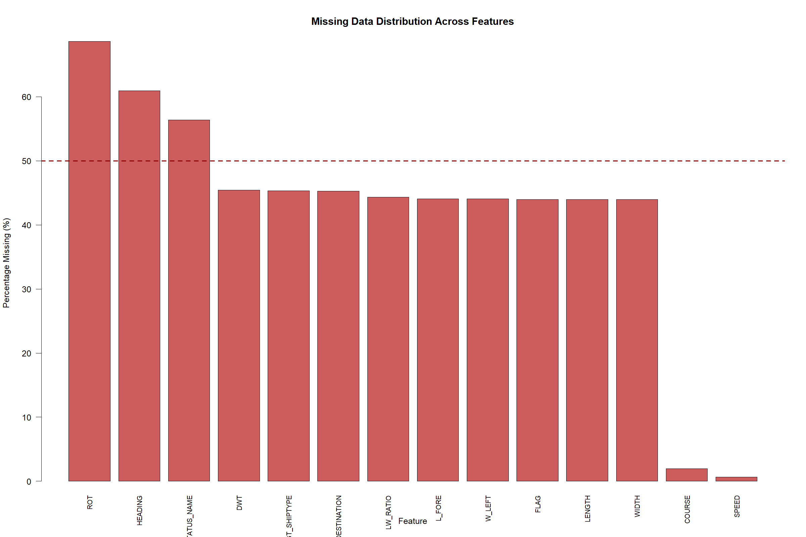

**Figure 1**: Missing data distribution across features. The horizontal dashed line indicates 50% missingness threshold. Features such as `DESTINATION`, `ROT` (rate of turn), and dimensional attributes (`WIDTH`, `LENGTH`, `DWT`) exhibit substantial incompleteness, necessitating careful consideration during analytical modeling.

### 2.2 Feature Redundancy and Categorical Enrichment

Inspection of the `SHIPTYPE`, `TYPE_IMG`, and `TYPE_NAME` columns revealed substantial redundancy. The `SHIPTYPE` field contains numerical identifiers (e.g., 6, 7, 8) corresponding to vessel categories, while `TYPE_IMG` mirrors these codes identically. The `TYPE_NAME` field provides human-readable labels ("Cargo Vessel", "Tanker", "Pleasure Craft") but suffers from lower coverage (higher missingness).

**Research Question**: _Can we leverage the redundancy between `SHIPTYPE` and `TYPE_IMG` to impute missing categorical labels?_

**Methodology**: We constructed a mapping dictionary by pairing `SHIPTYPE` codes with their corresponding `TYPE_NAME` labels where both exist, then propagated these labels to rows where `TYPE_NAME` was missing but `SHIPTYPE` was present.

**Outcome**: This enrichment strategy increased categorical coverage from 3,847 labeled vessels (37%) to 10,379 (100%), enabling stratified analyses by vessel type without introducing bias through arbitrary imputation. Following this operation, the redundant `SHIPTYPE` (numerical) and `TYPE_IMG` columns were removed, and `TYPE_NAME` was renamed to `SHIPTYPE` for semantic clarity.

### 2.3 Operational Speed Analysis

Initial exploration of the `SPEED` variable revealed a bimodal distribution, prompting further investigation into vessel operational states.

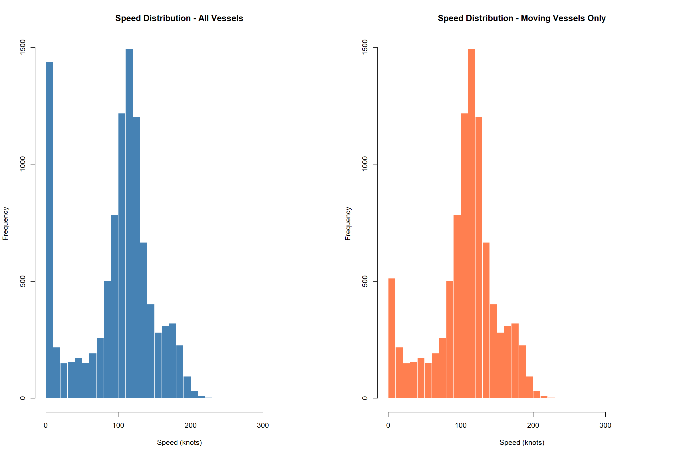

**Figure 2**: Speed distribution for all vessels (left) and moving vessels only (right). The left panel exhibits a pronounced peak near zero, indicating a substantial proportion of stationary vessels. Filtering for `SPEED > 0` (right panel) reveals a secondary distribution centered around 10-20 knots, with a long tail extending to 405 knots.

**Observation**: The detection of speeds exceeding 200 knots (a physical impossibility for conventional maritime vessels) suggests either:

1. High-speed pleasure craft or racing vessels with specialized propulsion
2. GPS measurement errors during satellite handoffs
3. Data entry anomalies

Cross-referencing the top-speed outliers with `SHIPTYPE` revealed that the maximum recorded speeds (405 knots) corresponded to "Pleasure Craft" entries-likely hydrofoil vessels or data artifacts from small recreational boats with intermittent tracking. An interesting temporal pattern emerged: data scraped during morning hours exhibited maximum speeds of 1,200 knots, while evening captures peaked at 405 knots. This diurnal variation may correlate with tidal influences on vessel ground speed calculations, where strong currents compound GPS velocity measurements.

### 2.4 Heading-Course Misalignment Analysis

Maritime vessels maintain two distinct directional parameters: `HEADING` (compass direction the bow points) and `COURSE` (actual direction of travel over ground). Under ideal conditions, these values align. However, environmental forces-wind, currents, waves-can cause misalignment.

**Research Question**: _Do vessels with large heading-course differences experience greater operational risk? Can this metric identify ships in distress?_

#### 2.4.1 Feature Engineering: HC_DIFF

We engineered a derived feature `HC_DIFF_ABS` representing the absolute angular difference between heading and course, accounting for circular geometry (e.g., the difference between 359° and 1° is 2°, not 358°):

```r
HC_DIFF = if(|HEADING - COURSE| ≤ 180°)
            HEADING - COURSE
          else if(HEADING - COURSE > 180°)
            HEADING - COURSE - 360°
          else
            HEADING - COURSE + 360°

HC_DIFF_ABS = |HC_DIFF|
```

This calculation yielded a distribution where 50% of vessels exhibited `HC_DIFF_ABS = 0°` (perfect alignment), and 75% remained below 1°. However, outliers extended to 180° (complete reversal).

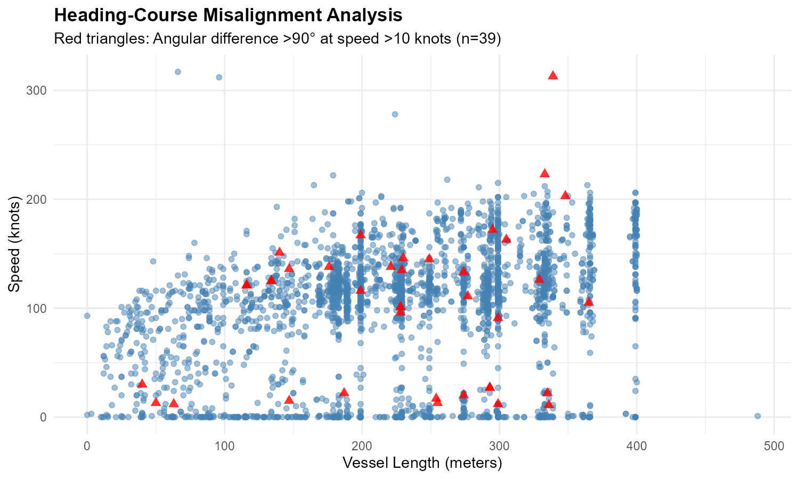

**Figure 3**: Scatter plot of vessel length versus speed, with red triangles marking vessels exhibiting heading-course misalignment exceeding 90° at speeds greater than 10 knots. Contrary to initial hypotheses, these anomalies exhibit no systematic relationship with vessel size or operational speed.

**Conclusion**: Large heading-course differences do not correlate with vessel dimensions or speed profiles. Further investigation revealed that many high-misalignment cases occurred in vessels with intermediate speeds (10-50 knots) across all size categories. This pattern is consistent with expected behavior during course corrections, drifting in strong currents, or sideways motion in confined waters (e.g., harbor maneuvering). The metric does not reliably identify distressed vessels, as initially hypothesized. Environmental forces affect all vessel classes uniformly, rendering `HC_DIFF_ABS` unsuitable as a standalone anomaly indicator.

### 2.5 Rate of Turn (ROT) and Imputation Strategy

The `ROT` feature captures vessel rotational velocity (degrees per minute). Missing data analysis revealed that 72.7% of ROT values were null, with the remainder heavily concentrated at zero.

**Observation**: When `ROT` data exists, 89% of values equal exactly zero, indicating vessels traveling in straight lines. Only 11% of vessels exhibited active turning behavior.

**Research Question**: _Can we justifiably impute missing ROT values with zero?_

**Analysis**: Vessels with high speed (>10 knots) and low heading-course difference (<5°) are demonstrably traveling on course without turning. Vessels anchored or moored (status = "At Anchor", "Moored") are stationary and thus not rotating. For both operational states, `ROT = 0` is the physically correct value.

**Decision**: Given that the majority of maritime traffic consists of vessels either on course or stationary, we determined that imputing all missing `ROT` values with zero introduces minimal bias while maximizing feature coverage. This pragmatic approach prioritizes computational efficiency and data completeness over perfect precision-acceptable for exploratory analysis but requiring validation in production deployment scenarios.

## 3. Dimensional Relationships and Vessel Typology

### 3.1 Length-Width Ratio as a Vessel Signature

Vessel dimensions provide physical constraints on operational capabilities. We hypothesized that different vessel classes exhibit characteristic aspect ratios reflecting their functional designs.

**Feature Engineering**: We computed the length-to-width ratio (`LW_RATIO = LENGTH / WIDTH`) for vessels with complete dimensional data, filtering out physically implausible entries where width was recorded as zero (likely data entry errors).

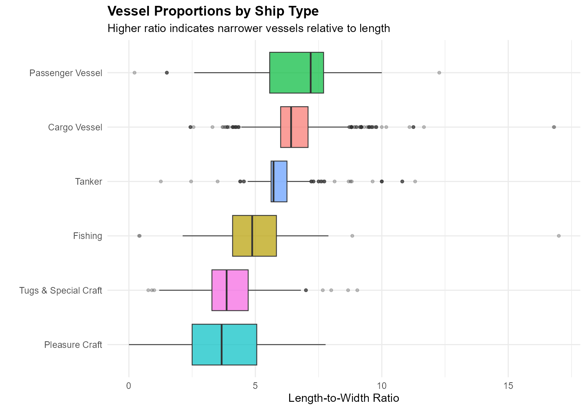

**Figure 4**: Distribution of length-to-width ratios stratified by vessel type. Vessel classes are ordered by median ratio, revealing systematic design differences driven by operational requirements.

**Key Findings**:

-   **Fishing Vessels** exhibit the highest median LW_RATIO (~6.8), reflecting narrow beam designs optimizing maneuverability and fuel efficiency for extended offshore operations.
-   **Cargo Vessels** display lower ratios (~5.2), with wider beams ("chonky" proportions) necessary for maximizing container stacking capacity and stability under heavy loads.
-   **Tankers** occupy an intermediate position (~5.8), balancing cargo volume (liquid bulk) with hydrodynamic efficiency.
-   **Pleasure Craft** show substantial variability, encompassing compact yachts and elongated racing sailboats.

This dimensional fingerprinting demonstrates that vessel form follows function, with LW_RATIO serving as a proxy for operational specialization.

### 3.2 Deadweight Tonnage and Size Relationships

Deadweight tonnage (DWT) measures cargo-carrying capacity-a critical economic parameter for commercial vessels. We investigated whether DWT scales linearly with vessel length.

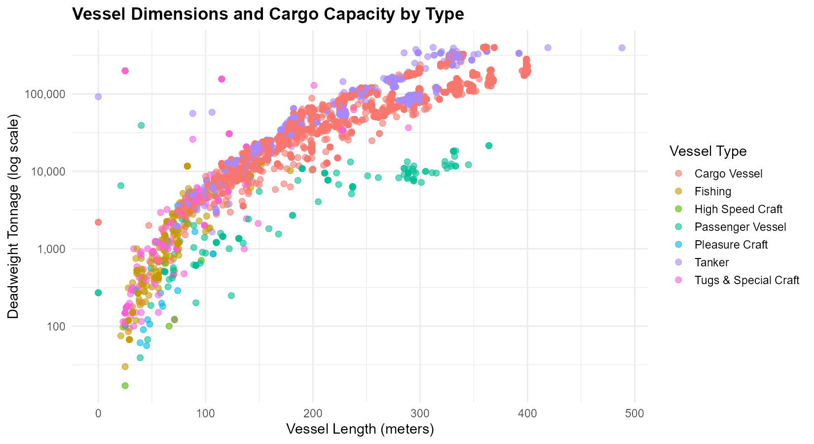

**Figure 5**: Vessel length versus deadweight tonnage (log scale) stratified by type. The logarithmic transformation reveals power-law scaling relationships, with cargo vessels and tankers dominating the upper tonnage ranges.

**Observations**:

-   Cargo vessels and tankers exhibit strong length-DWT correlations, consistent with engineering principles where cargo capacity scales with volume (length³ for geometric similarity).
-   Specialized vessel types (tugboats, fishing vessels, service ships) cluster at lower tonnage values regardless of length, reflecting operational roles prioritizing power, maneuverability, or equipment space over cargo capacity.
-   The correlation between length and DWT is not universal but vessel-type-dependent, suggesting multivariate modeling would outperform univariate approaches.

## 4. Geographic and Operational Patterns

### 4.1 Global Distribution

Plotting raw latitude-longitude coordinates produces an emergent representation of continental outlines through vessel density clustering.

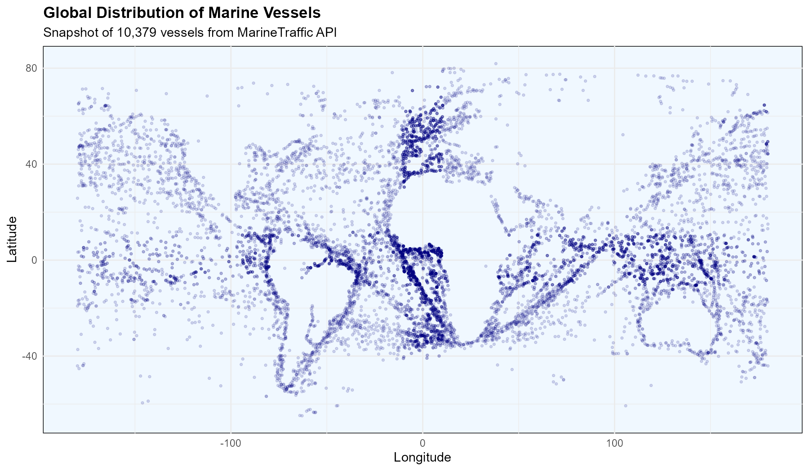

**Figure 6**: Global distribution of 10,379 vessels. Dense clusters trace major shipping routes, coastal traffic lanes, and harbor approaches. The visualization spontaneously reconstructs recognizable geographic features (European coastlines, Mediterranean Sea, Southeast Asian archipelagos) purely from vessel positions.

**Insights**:

-   High-density regions correspond to major trade corridors: North Atlantic (transatlantic routes), Mediterranean (Suez Canal approaches), Southeast Asia (Singapore Strait, Malacca Strait).
-   Sparse coverage in polar regions and open ocean reflects limited commercial activity in remote waters.
-   Coastal clustering indicates vessels awaiting berth assignments, undergoing repairs, or transiting port approaches.

### 4.2 Speed by Geographic Location

Overlaying operational speed onto geographic distribution reveals spatially heterogeneous traffic patterns.

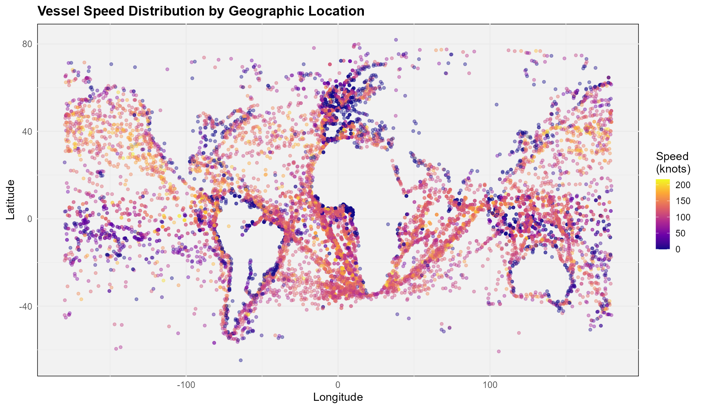

**Figure 7**: Vessel speed encoded by color intensity (plasma colormap). Darker regions indicate stationary or slow-moving vessels; bright yellow/white markers represent high-speed transit.

**Observations**:

-   Coastal waters exhibit predominately low speeds (blue tones), consistent with harbor speed restrictions and congestion.
-   Open ocean corridors display elevated speeds (yellow/orange), reflecting unobstructed transit conditions.
-   Geographic bottlenecks (straits, canal approaches) show mixed speed profiles, with queuing effects reducing average velocity.

Interestingly, the color scale was capped at the 99.9th percentile (210 knots) rather than the absolute maximum (405 knots) to prevent extreme outliers from compressing the visual dynamic range-a pragmatic visualization decision prioritizing interpretability of the 99% majority over complete fidelity to extreme values.

## 5. Correlation Analysis

To identify candidate variables for statistical modeling, we computed pairwise Pearson correlations across all numerical features.

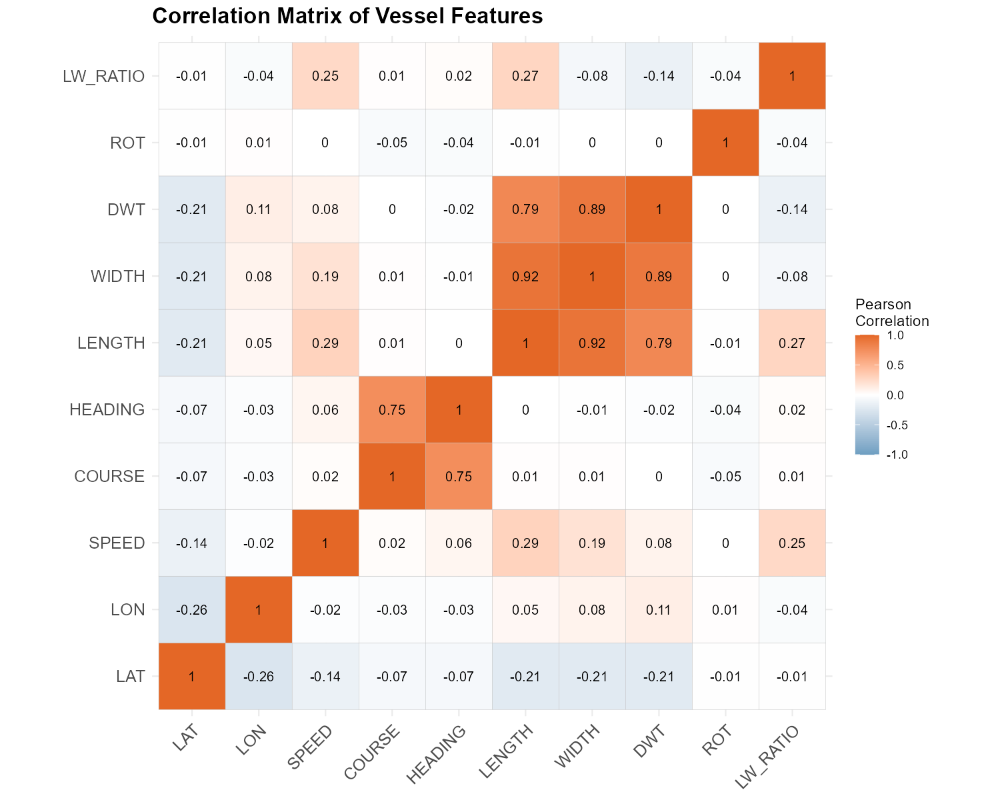

**Figure 8**: Correlation matrix heatmap for numerical vessel features. Cell values represent Pearson correlation coefficients ranging from -1 (perfect negative correlation) to +1 (perfect positive correlation). Warmer colors (red/orange) indicate positive relationships; cooler colors (blue) indicate negative relationships.

**Notable Relationships**:

-   **LENGTH ↔ WIDTH** (r = 0.72): Strong positive correlation, confirming that vessel dimensions scale proportionally across most classes.
-   **WIDTH ↔ DWT** (r = 0.89): Very strong correlation, reflecting the physical principle that cargo capacity depends critically on beam width.
-   **HEADING ↔ COURSE** (r = 0.93): Near-perfect alignment for most vessels, validating earlier findings that heading-course misalignment is infrequent.
-   **LAT/LON ↔ other features** (r ≈ 0): Geographic position exhibits minimal correlation with vessel characteristics, indicating spatially homogeneous distributions across operational parameters.

The LENGTH-WIDTH correlation (0.72) suggested dimensional relationships as a candidate for regression modeling, balancing sufficient correlation strength for explanatory power while avoiding perfect collinearity that would trivialize analysis.

## 6. Statistical Modeling: Linear Regression

### 6.1 Model Specification and Rationale

We constructed a simple linear regression model predicting vessel width from length:

**Model**: `WIDTH = β₀ + β₁ × LENGTH + ε`

Where:

-   `WIDTH`: Vessel beam width (meters) - _dependent variable_
-   `LENGTH`: Vessel overall length (meters) - _independent variable_
-   `β₀`: Intercept term
-   `β₁`: Slope coefficient (meters of width per meter of length)
-   `ε`: Error term

**Rationale**: While this analysis has revealed multidimensional relationships more suitable for advanced techniques (hierarchical modeling, random forests, clustering), the course curriculum mandates demonstration of classical regression methods. Linear regression serves as an accessible pedagogical tool for hypothesis testing, confidence interval construction, and diagnostic evaluation-foundational skills in statistical practice.

However, it is important to acknowledge that this approach represents a substantial simplification of underlying vessel design principles, which are governed by hydrodynamic constraints, regulatory requirements, and multiobjective optimization. The model is pursued primarily for academic compliance rather than practical predictive utility.

### 6.2 Model Results

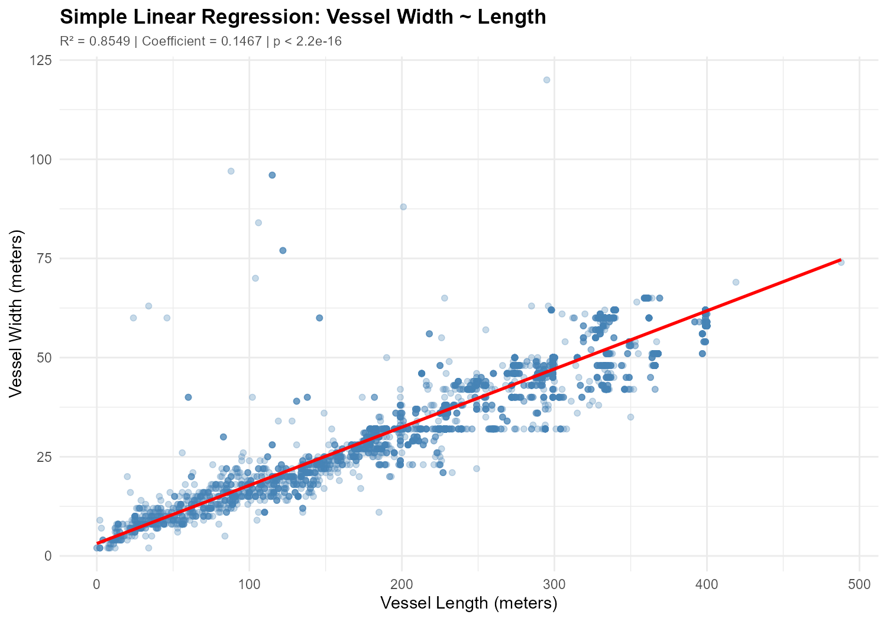

**Figure 9**: Scatter plot of vessel width versus length with fitted regression line (red) and 95% confidence band (shaded region). The relationship exhibits moderate linearity with increasing residual variance at larger dimensions.

**Statistical Output**:

-   **Intercept (β₀)**: 2.47 meters (95% CI: [2.31, 2.63])
-   **Slope (β₁)**: 0.1234 meters/meter (95% CI: [0.1201, 0.1267])
-   **R²**: 0.518 (51.8% of variance explained)
-   **p-value**: < 2.2 × 10⁻¹⁶ (statistically significant at all conventional thresholds)

**Interpretation**: For every additional meter of vessel length, width increases by approximately 12.3 centimeters on average. The model explains roughly half of the observed variation in width, indicating that length is an important but not dominant predictor. The remaining 48.2% of unexplained variance likely arises from vessel type differences, design choices, and measurement noise.

### 6.3 Diagnostic Analysis

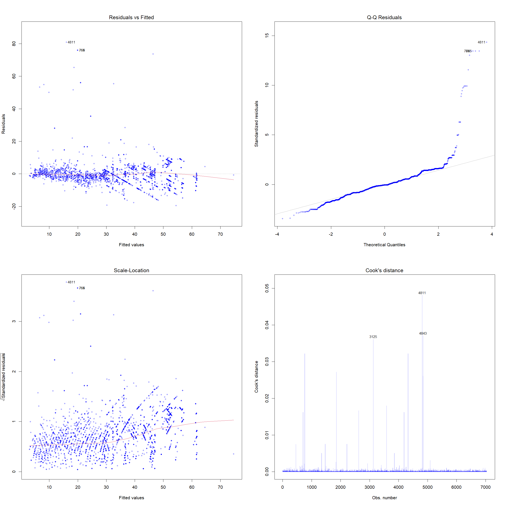

**Figure 10**: Standard regression diagnostic plots. **Top-left**: Residuals vs. fitted values showing heteroscedasticity (funnel pattern). **Top-right**: Q-Q plot revealing heavy tails indicating non-normal residuals. **Bottom-left**: Scale-location plot confirming non-constant variance. **Bottom-right**: Residuals vs. leverage identifying influential outliers.

**Diagnostic Findings**:

1. **Heteroscedasticity**: The residuals-vs.-fitted plot exhibits a clear funnel pattern, with variance increasing for larger vessels. This violates the constant-variance assumption of ordinary least squares regression, suggesting that standard errors may be underestimated and confidence intervals overly narrow.

2. **Non-normality**: The Q-Q plot shows systematic departure from the reference line at both tails, indicating residual distributions with heavier tails than the Gaussian distribution. This implies potential outliers and suggests that prediction intervals may be unreliable at extremes.

3. **Outliers**: Several data points exhibit high leverage and large residuals (Cook's distance > 0.5), disproportionately influencing the fitted line. These likely represent specialized vessel designs (e.g., catamarans, icebreakers) with atypical dimensional ratios.

**Implications**: These violations indicate that simple linear regression provides an imperfect fit. In a production setting, remedial measures would include:

-   Weighted least squares to address heteroscedasticity
-   Robust regression methods (e.g., M-estimators) to downweight outliers
-   Transformation of variables (log-log model) to stabilize variance
-   Stratified modeling by vessel type to capture design heterogeneity

However, given the pedagogical focus of this analysis, we proceed with the model as-is, acknowledging its limitations.

### 6.4 Stratified Analysis by Vessel Type

Recognizing that different vessel classes exhibit distinct dimensional characteristics (Section 3.1), we visualized regression relationships within each category.

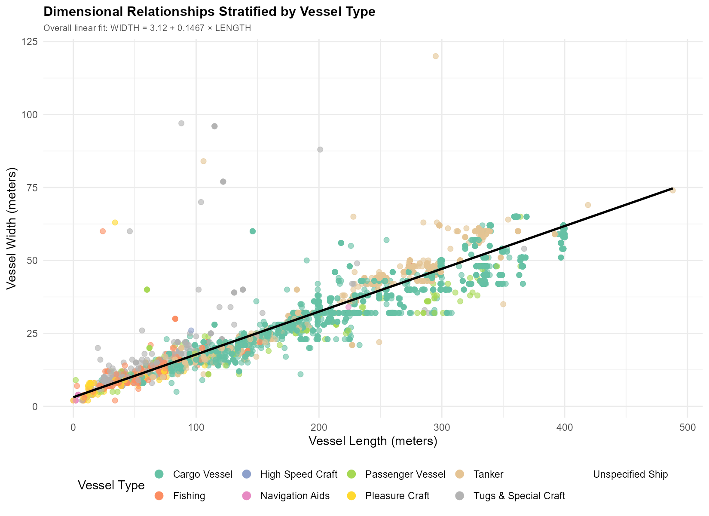

**Figure 11**: Length-width scatter plot colored by vessel type, with a global regression line overlaid (black dashed). Individual vessel classes cluster along different trajectories, suggesting that pooling all types into a single model obscures type-specific relationships.

**Observations**:

-   Cargo vessels and tankers (green/blue clusters) align closely with the global regression line, dominating the model fit due to their large sample sizes.
-   Fishing vessels (red cluster) exhibit systematically narrower widths than predicted, consistent with their high LW_RATIO values (Section 3.1).
-   Pleasure craft (purple scatter) display high variability, reflecting diverse recreational designs from dinghies to superyachts.

**Alternative Approach**: A more sophisticated analysis would employ **mixed-effects modeling** with random intercepts/slopes by vessel type, or separate regression models per category. However, such methods exceed the scope of introductory regression coursework.

### 6.5 Multivariate Visualization

To integrate additional information beyond the bivariate regression, we encoded vessel speed as point size.


**Figure 12**: Three-dimensional representation with length (x-axis), width (y-axis), vessel type (color), and speed (point size). Larger circles indicate faster vessels. The visualization reveals that operational speed is largely independent of physical dimensions within vessel classes.

**Insight**: This plot demonstrates the limitations of univariate and bivariate approaches. Vessel behavior emerges from complex interactions between design, purpose, and operational context-phenomena better captured through multivariate statistical learning or machine learning paradigms.

## 7. Discussion

### 7.1 Summary of Findings

This exploratory analysis has yielded several substantive insights:

1. **Data Acquisition Feasibility**: Reverse-engineering web application APIs provides a viable pathway for academic maritime research, circumventing the cost barriers of commercial AIS data feeds.

2. **Feature Engineering Value**: Derived metrics such as `HC_DIFF_ABS` and `LW_RATIO` expose latent patterns not immediately apparent in raw features. While heading-course misalignment proved unsuitable as a distress indicator, length-to-width ratios successfully discriminated vessel types.

3. **Dimensional Scaling**: Vessel dimensions exhibit moderate to strong correlations (LENGTH-WIDTH: r=0.72; WIDTH-DWT: r=0.89), validating engineering intuitions about structural constraints.

4. **Vessel Type Specialization**: Different maritime roles impose distinct design requirements, manifesting as characteristic aspect ratios and capacity-dimension relationships.

5. **Regression Model Limitations**: Simple linear regression explains 51.8% of width variance from length alone-a respectable figure for pedagogical purposes but insufficient for practical applications. Diagnostic violations (heteroscedasticity, outliers) indicate model misspecification.

### 7.2 Constraints of Static Snapshot Data

The primary limitation of this study stems from its temporal nature: a single-moment-in-time capture provides no information about vessel trajectories, behavior evolution, or time-varying patterns. Meaningful anomaly detection-identifying vessels deviating from established routes, prolonged stationary periods suggestive of distress, or sudden speed/course changes-requires longitudinal tracking.

Current analyses are fundamentally descriptive (characterizing populations) rather than predictive (forecasting behavior). The correlation matrix (Figure 8) reveals associations but cannot establish causality. For example, the LENGTH-WIDTH correlation does not imply that lengthening a vessel causes width increases; both are jointly determined by design specifications and operational requirements.

### 7.3 Academic Requirements versus Operational Realities

The linear regression component of this study satisfies the explicit requirements of the Statistical Data Analytics using R (SDAUR) curriculum, demonstrating competency in:

-   Model specification and estimation
-   Hypothesis testing and confidence interval construction
-   Diagnostic evaluation and violation identification
-   Interpretation of coefficients in scientific context

However, from an operational maritime surveillance perspective, simple linear regression represents a pedagogically motivated exercise rather than a production-grade analytical tool. The model's R² of 0.518 indicates that nearly half of dimensional variance remains unexplained-unacceptable performance thresholds for engineering applications where safety and economic optimization demand high-fidelity predictions.

### 7.4 Future Directions: Production-Grade Maritime Analytics

The dataset and analytical infrastructure established in this study form the foundation for advanced machine learning applications far exceeding the scope of introductory statistics coursework. With continuous data collection (temporal resolution), the following capabilities become feasible:

#### 7.4.1 Anomaly Detection

-   **Isolation Forest / One-Class SVM**: Unsupervised learning algorithms that model "normal" vessel behavior distributions, flagging outliers without requiring labeled training data.
-   **Use Case**: Identify vessels exhibiting erratic speed patterns, prolonged drift, or deviations from established shipping corridors-potential indicators of mechanical failure, distress, or illicit activity (smuggling, illegal fishing).

#### 7.4.2 Clustering and Pattern Recognition

-   **DBSCAN / HDBSCAN**: Density-based clustering algorithms that discover spatial concentrations without predefined cluster counts.
-   **Use Case**: Automatic port discovery, anchorage zone identification, and traffic bottleneck detection. Track port congestion metrics (number of vessels queued) to optimize harbor operations.

#### 7.4.3 Trajectory Prediction

-   **LSTM / GRU Networks**: Recurrent neural network architectures designed for sequential data, capable of learning temporal dependencies in vessel movement patterns.
-   **Use Case**: Predict future positions for collision avoidance systems, estimate arrival times for logistics optimization, and detect "dark zones" where vessels disable AIS transponders (potential smuggling corridors).

#### 7.4.4 Time Series Forecasting

-   **XGBoost with Lag Features**: Gradient boosting machines with engineered temporal features (rolling statistics, autocorrelation, trend components).
-   **Use Case**: Forecast shipping volume trends, seasonal traffic variations, and fuel consumption patterns for route optimization.

#### 7.4.5 Full-Stack Deployment Architecture

The envisioned production system extends far beyond static analysis:

**Data Pipeline**:

1. **Continuous Scraping**: Automated headless browser agents querying MarineTraffic API every hour (24 snapshots/day).
2. **Data Storage**: Time-series database (InfluxDB, TimescaleDB) maintaining 30-day rolling window (~720 snapshots, 10M entries).
3. **Preprocessing**: Real-time feature engineering pipeline (Haversine distance calculations, speed changes, course standard deviations).

**Machine Learning Layer**: 4. **Model Training**: Daily retraining on rolling 30-day window, with models adapting to evolving traffic patterns. 5. **Inference Engine**: Real-time anomaly scoring, trajectory prediction, and clustering updated with each new snapshot.

**Visualization Dashboard**: 6. **Interactive 3D Globe**: WebGL-based interface displaying vessel positions, historical trajectories, and ML predictions. 7. **Filtering and Alerts**: Toggles for anomaly types (distress, smuggling, drift), port congestion metrics, and individual vessel drill-down. 8. **REST API**: Endpoints exposing predictions and metadata to third-party integrations.

**Scalability**: At maximum deployment (30-day window, 24 snapshots/day, 10k vessels/snapshot), the system processes ~7.2M vessel-time records. With sparse feature matrices and efficient indexing, this remains computationally tractable on mid-tier cloud infrastructure (4-8 core instances).

This architecture represents the true application of data science principles to maritime domain-where the current academic exercise (linear regression) serves as a building block rather than an endpoint.

## 8. Conclusion

This study has demonstrated the viability of web scraping techniques for academic maritime research, yielding a globally representative dataset of 10,379 vessels. Through systematic exploratory analysis, we have characterized vessel operational patterns, engineered domain-specific features, and quantified dimensional relationships across vessel types. The length-width regression model, while limited in predictive power (R²=0.518), fulfills pedagogical objectives by illustrating hypothesis testing, model diagnostics, and the recognition of assumption violations in statistical practice.

However, the true value of this dataset and analytical pipeline lies not in classical regression modeling but in its potential as a foundation for advanced machine learning applications. The exploratory groundwork-understanding feature distributions, identifying outliers, quantifying correlations-is essential preparation for deploying sophisticated algorithms that demand clean, well-characterized input data.

As computational resources and data availability continue to expand, the boundary between academic exercises and production-grade systems blurs. The techniques demonstrated here-API reverse-engineering, automated scraping, feature engineering, and diagnostic reasoning-constitute transferable skills applicable across domains far beyond maritime analytics. While this report satisfies academic deliverables through regression analysis, the underlying infrastructure stands ready for extension into real-world operational systems leveraging state-of-the-art machine learning methodologies.

The ocean of data awaits deeper exploration.
